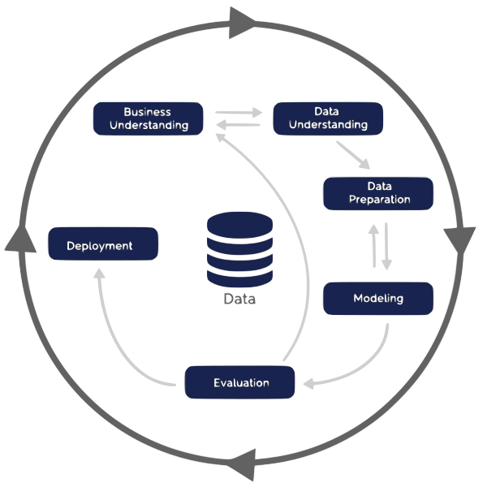
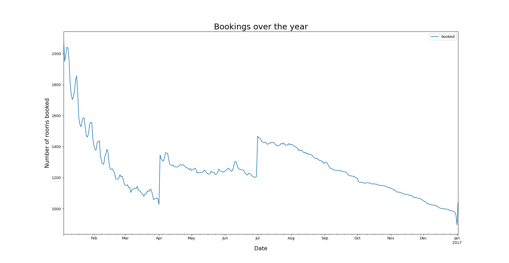
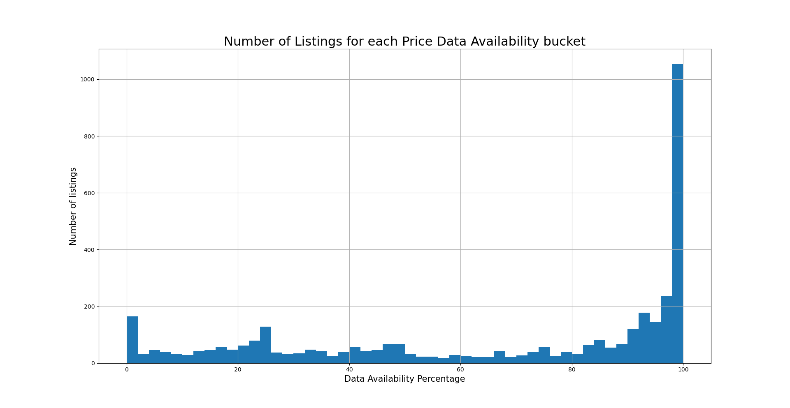

# Analysis of Seattle's Airbnb Data
The purpose of this project is to perform data mining on the Airbnb dataset for Seattle. This
has to be done in accordance with the CRISP-DM methodology. To start off, here is a visualization of 
CRISP-DM:

  

Source: (https://www.kaggle.com/airbnb/seattle/data)

## What does the annual business lifecycle look like?
In order to try and understand how CRISP-DM works, I decided to try the cycle with a simple task. The aim
is to understand what the airbnb business looks like in Seattle.

### Business Understanding
The first

To understand this, we first visualize what the room bookings throughout the year look like.
The following plot shows this:

## Calendar Data
The first thing that strikes me is that there is a lot of missing data in the price column so I decided
to see how much data was missing. To visualize this, I plotted how populated the price data is for each
listing id. The following histogram is what I got:

The x-axis is 50 buckets of price data availability percentages and the y-axis is the number
of listings in that bucket. (eg. The last bucket is 98-100% and the y-value is >1000) This means
that more than a 1000 listings have price data available for 98-100% of the days for which they were listed.