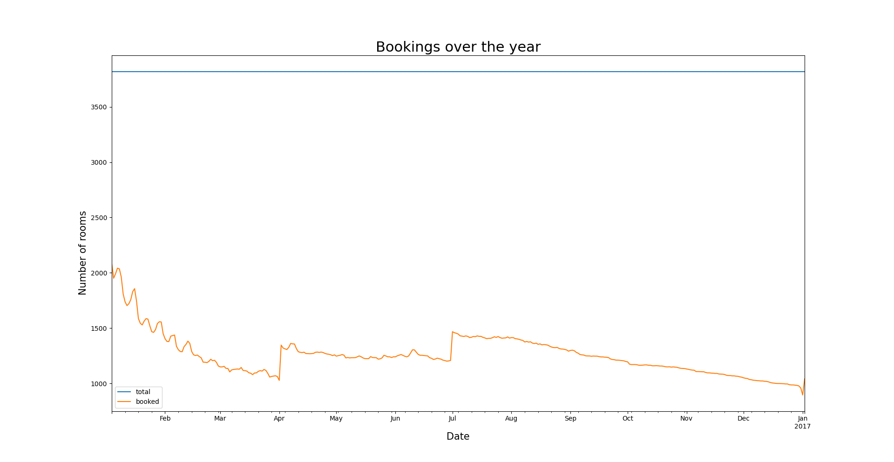

# Analysis of Seattle's Airbnb Data
The purpose of this project is to demo a data mining project for Udacity. This has to be done in accordance with the 
CRISP-DM methodology. To start off, here is a visualization of CRISP-DM:

<p align="center">
  
</p>
Source: (https://blog.magrathealabs.com/crisp-dm-and-what-i-did-wrong-70c4e7e8656)

## Structure
The structure of this project is as follows:
* ./data/ - This is the directory with all the data
* ./jupyter/ - This contains the jupyter notebooks for this project
* ./viz/ - This contains all the visualizations of the project

This is actually a pycharm project with a sub-section for the jupyter notebooks.

## Choosing a Dataset
For this exercise, I decided to use Airbnb's Seattle data set for two reasons. Firstly the data set looks interesting
and it is one whose context I can fully grasp. Secondly, this was suggested by Udacity and I thought I may find 
more support in case I run into issues. The data set is available here: (https://www.kaggle.com/airbnb/seattle/data)

## The first question
In order to try and understand how CRISP-DM works, I decided to try the cycle with a simple task. The first thing I
wanted to do was to understand how busy the Airbnb scene in Seattle is based on the available data.

### Business Understanding
The first step in this process is the business understanding. In order to gain understanding, it is crucial
to ask the right question and to pose the problem correctly. In our case, we want to understand how busy Airbnb
is in Seattle. The most logical question to ask then is:

Based on the data, what does room listing and availability over time in Seattle look like?

**Objective:** The objective of this cycle is to find out how many rooms are listed and how many are 
booked/available at any given time.  
**Assessment:** The way to assess success is pretty straightforward. If we can visualize the data, we succeeded.

### Data Understanding
The purpose of the data understanding step is to collect, describe, explore, and verify the data sources necessary
to answer the business question. The data set consists of the following 3 files:
* calendar.csv
* listings.csv
* reviews.csv

The data we want is in the calendar.csv. To preview this I loaded it up in the jupyter notebook at 
jupyter/main.ipynb. But first I installed the ability to import util.ipynb from main.ipynb like this :
 ```python
 # This installs the ability to import jupyter notebooks
import sys

!{sys.executable} -m pip install import_ipynb
 ```
 
 I then loaded the data:
 ```python
 # Read a CSV
import import_ipynb
from util import *

calendar = read_csv('../data/calendar.csv')

calendar.head()
 ```
Notice I imported util which contains a special read_csv function which extends pandas.read_csv to make it more
memory efficient. This is what we see:


So we see that 1 record in calendar is 1 day's availability for 1 listing and its price. It looks like there are 
missing values in price but what we care about the following columns:
* listing_id
* data
* available

Let's see if any of them have missing values (They don't):


### Data Preparation & Modelling
The next step is to prepare the data for modelling. For this one needs to  select, clean, construct, and format
the data. In our case we just need to select, and construct the data. What we want to know is : 
For every day, how many rooms were listed and how many were booked.

The way we do this is by iterating through the whole date range and plotting how many properties were listed
on that day and how many properties were booked that day. The following is the code to do this

```python
import import_ipynb
from util import *
from datetime import timedelta

# This is what we want to populate and plot
listing_data = pd.DataFrame(columns=['date', 'total', 'booked'])

calendar = pd.read_csv('../data/calendar.csv', parse_dates=['date']).pipe(reduce_mem_usage)

# These are the min and max dates in calendar
current_date = min(calendar['date'])
end_date = max(calendar['date'])

while current_date <= end_date:

    todays_listings = calendar[calendar['date'] == current_date]

    total = row_count(todays_listings)
    booked = row_count(todays_listings[todays_listings['available'] == 'f'])

    listing_data = listing_data.append({'date': current_date, 'total': total, 'booked': booked}, ignore_index = True)

    if(current_date.day == 1):
        print('Data collected for ' + str(current_date))

    current_date = current_date + timedelta(days=1)

standardize_plot_fonts()

plot = listing_data.plot(x='date')
plot.set_xlabel('Date')
plot.set_ylabel('Number of rooms booked')
plot.set_title('Bookings over the year')

plt.show()
```
The following is the resulting plot:



In this case, the modelling step is very small because all we're doing is generating a plot which you can see above

### Evaluation
Now to answer the question that we asked. Based on the data we have (Jan. 2016 to Jan. 2017), it looks like the number
of rooms booked has been steadily declining however there have been 2 spikes. Once at April start and the second
at Jul start.

We don't know whether nor not these spikes are cyclical as we don't have multiple years' data. The other remarkable
trait is that the total number of listings at any given time never deviates from 3818. This was not initially obvious.
This seems to indicate that there must be a business rule limiting the number of properties that can be listed in
Seattle.

## The Second Question
For the next cycle, I decided to dig a little deeper into the data set. Now I've decided I want to understand
how the properties in Seattle are priced on Airbnb. This is an abstract requirement so we have to ask a concrete
question.

### Business Understanding
The question should be:

What are the primary factors in the property specifications that affect the price and how do they correlate?

**Objective:** The objective here is to find those factors (if any) that correlate most strongly with the listed
price of a property and understand the nature of that correlation.   
**Assessment:** If we are able to find at-least 1 correlating factor and determine 
how the price correlates with the factor, we will have succeeded.

### Data Understanding
The data that we need is pricing data. A quick look at the csv files reveals a problem. Both the calendar.csv
and the listings.csv files have a 'price' column. The latter file has 2 more columns called 'weekly_price'
and 'monthly_price'. This looks to me like the 'price' column in listings.csv must the default daily price for the
property that the prospective landlord sets up initially and the 'price' column in calendar.csv must be set at
the time of listing (to override default value). To verify this, I decided to cross-check the 'price' column values
in the 2 files.

This can be a bit tricky because the 'price' values in the 2 might be slightly off but that doesn't necessarily
mean they don't match. To solve this problem, I decided to visualize instead what the price differences actually look like.
I joined the calendar.csv and listings.csv tables on listing id and generated a list of price diff values. I then
plotted the price diff values in a histogram to get their profile. This is what I got:


This figure visualized the frequency of diff values and it is pretty much what I expected to see. In the vast majority
of cases, the difference between the calendar price and the listing price is 0 as the histogram shows. What this tells
us is that both these columns are the daily price of the property which means we can use the 'price' column in 
listsings.csv. 

To explore the data further, I picked a few magnitude columns in listings.csv that could correlate with price
(I'm ignoring the categorical variables for now) and plotted a correlation matrix. This is what I got:


This indicates that there is a practically usable correlation between the price and some of the other columns.
The next logical thing is to plot the following columns against price as they show promise:

* accommodates (65%)
* bedrooms (63%)
* beds (59%)
* bathrooms (52%)
* guests_included (39%)

The following are these plots:

| | | 
|:-------------------------:|:-------------------------:|
|
|
 |

As we can see, the accommodates column has the cleanest correlation

### Data Preparation
Following this insight, I did what appeared logic to me. I tried to fit a simple model to this data so I could
predict a property's price based on the 5 columns in the previous section. I will briefly run through what I did
before explaining why this was mostly futile.

Data preparation in this case is straightforward. The first thing I did is put the price values into buckets.
This makes sense given that the data clearly has a many-to-one relationship (ie. price to input). I experimented
with different bucket sizes before settling on 50. The next step is to pick out the columns and normalize them.
I did this and created a new csv called 'pricing_model_train.csv'

### Modelling
I tried to train the MLPClassifer in numpy on this data. The code is in the jupyter notebook main.ipynb. This is
what the confusion matrix looks like:


(Note: In theory this should be a 20x20 matrix for each of the 20 buckets ($1000 / 50 = 20) but this just works
on the test data which is set to be 30% of all the data. Also note that the heatmap is normalized (code provided))

The confusion matrix doesn't look so bad however despite tinkering with the parameters for a long time I was unable
to get it to be any more accurate. I then came across the explanation for this. What we have here is an example
of the multicollinearity problem.

Essentially the multicollinearity problem describes a situation where the input parameters in the training data
are correlated with each other. The reason this is problem is that it is difficult for a model to check the 
effect of 1 input variable on the output variable independently because it is unable to keep the other input
variables constant (because they are correlated).

So if this were true, then it would mean that I can use 1 input variable (the best one) and fit the model and
the results shouldn't be very different. I did this and this is the confusion matrix I got:


We can see here that the accuracy hasn't changed drastically which is what I expected

### Evaluation
Firstly we must answer the question we are trying to answer. The answer is that the 'accommodates', 'bedrooms', 'bed',
'bathrooms', and 'guests_included' columns correlate positively with the 'price' column. This relationship
is evident in the box plots we saw in the Data Understanding section.

Evaluating a classifier model is straightforward. We can find the precision (Recall is less relevant here as there are
more than 2 output classifications)
* 5 input model precision: 55.4%
* 1 input model precision: 53.0%

The precision barely differs when we go from 1 input to 5 inputs. As discussed above, this is a result of the fact
that the inputs correlate with each other so the additional 4 input parameters don't bring any new info that can
be used to narrow down the value of the output parameter. Because reviewing the process is part of evaluating, I
should mention that we should ensure that input variables don't correlate with each other before we train our model.

## The Third Question
For the third CRISP-DM cycle, I decided I wanted to include an additional data set to do some comparative analysis.
There is another data set of Airbnb listings and bookings for Boston that is in the same format as this data set for
Seattle. This is very convenient as it will make data understanding and preparation very simple. What I'd like to 
understand this time is how the apartments in Seattle compare with the ones in Boston

### Business Understanding
The question in this case should be:

How do the key specs for the apartments in Seattle compare to the ones in Boston and how pricey are they?

**Objctive:** The objective here is to compare the specs of apartments in Seattle vs Boston 
and also compare their prices.  
**Assessment:** This will likely be a statistical model. If this is how we answer the question, we will assess
the quality of the model using the p-value.

### Data Understanding
The first thing to do is to get the Airbnb data set for Boston. It is available here:
(https://www.kaggle.com/airbnb/boston).  
It has been downloaded to the 'data/boston' folder. If we take a look, it has the same three files as the
Seattle data set which is good news as we want to compare things. If we look at the shape of the data, calendar and
reviews have the same shape: 


The listings.csv files however differ so let's find out if this is a problem. To find out, we need to know which
features we care about. In the listings.csv, the following features would be helpful in answering the question:
* room_type
* accommodates
* bathrooms
* bedrooms
* beds
* price

All of these features are in the listings.csv file for Boston so we don't have a problem

### Data Preparation & Modelling
For data prep, all we do is join the Seattle and Boston listings into a single csv where the columns are the above
plus another for 'city'.

We want to compare the specs of the apartments in Seattle vs. Boston. The appropriate model to do this is the
violin plot so I plotted one to compare the prices in Seattle vs. Boston and this is what I got.


(**Note:** I've bucketed the price values into buckets of size 50)

The thin needle at the top results from large price outlier values in the Boston data. It looks like all meaningful data
is below the $1,000 which is also the max for the Seattle data so it makes sense to prune the price and re-plot:


Based on the chart above, there isn't an obvious answer to the question: Which city is pricier so I broke down the 
data further based on the apartment specs and generated a set of charts to visualize how expensive different kinds
of apartments are between the two cities. The following are the charts:

| | | 
|:-------------------------:|:-------------------------:|
|
|
|

A cursory glance at the above charts indicates that the properties in Boston are generally pricier than the 
equivalently spec'd apartments in Seattle but this is a statement about price of equivalent properties in the two
cities. It is not a comparison of the nature of the properties themselves.

The following charts show the quantity of different property types in the two cities

| | |
|:-------------------------:|:-------------------------:|
|
|
(**Note:** I created a redundant x-axis because seaborn doesn't like to plot violin charts without one)

If one looks carefully at the charts above, it will become apparent that Boston generally has more properties at the 
smaller end and fewer at the larger end of the property size spectrum. The conclusion that I derive from that is
that properties in Boston are generally smaller.

The following chart compares the explicitly classified property types in the two cities:


This chart further reinforces this conclusion. Seattle has more full houses and Boston has more private rooms. The
shared room category is not big enough to be statistically significant.

### Evaluation
To re-iterate the third question was :

How do the key specs for the apartments in Seattle compare to the ones in Boston and how pricey are they?

The answer to this question is: Based on the key specs we chose, it looks like the properties in Boston are generally
smaller than the ones in Seattle. Also, properties in Boston are more expensive when compared to 
equally spec'd properties in Seattle.
